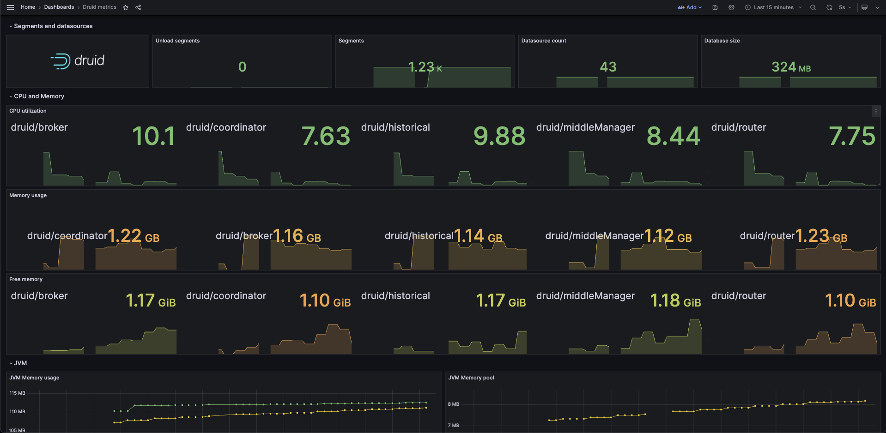
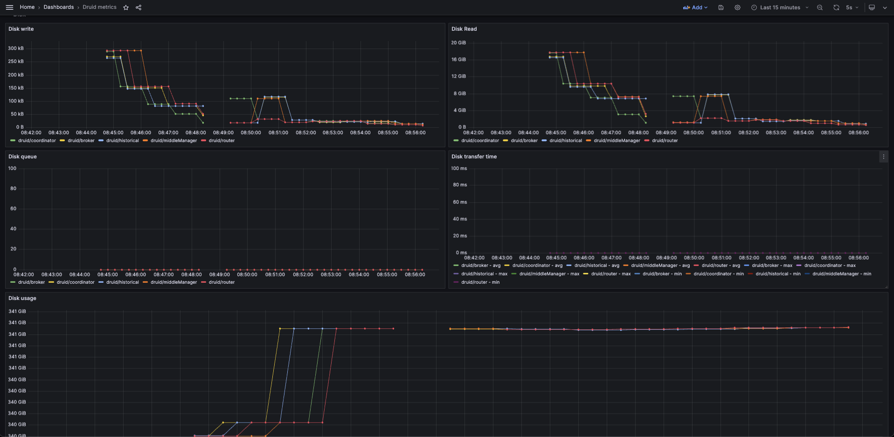

# Druid Exporter

<p align="center">
    
    
    
    
    
    
    
</p>


```
            ...................                                  ....................
           ~YYYYYYYYYYYYYYYYYYYYJ?~.                        .^7JYYYYYYYYYYYYYYYYYYYY7
                            ...:~7Y5J^                    :?5Y?~:...
                                   :?PJ.       .^:       7PJ^
?YYYY?. ^YYYYYYYYYYYYYYYYYYYJ?~.     ^P5.      !GJ      JG!      ~7JYYYYYYYYYYYYYYYYYYY!  7YYYYJ.
.:::::  .:::::::::::::::::::^!YP7     ~GJ      !GJ     !G?     ~557~:::::::::::::::::::.  .:::::
                               ?G7    .P5.     !GJ     JG^    ^GY.
              ~YYYYYYYYYYYYYYYYYGPYYYYYPPYYYYYY5GPYYYYYPG5YYYYPG5YYYYYYYYYYYYYYYYY7
              .::::::::::::::::YG7::::7G?::::::7GY:::::!GJ::::~G5^::::::::::::::::.
                             .?G?    .5P.      !GJ      YP:    !PY:
      :::::::::::::::::::^^!J5Y~    .YP^       !GJ      .5P^    :JPY7~^:::::::::::::::::::
     .?YYYYYYYYYYYYYYYYYYJJ?!:    .!P5:        :?~       .JP?.    .~7JJYYYYYYYYYYYYYYYYYYJ:
                                :755!                      ~YP?^.
             ....    .....::~!J55J~                          ^?55J7~^:.....    ....
            !YYYYJ. ^YYYYYYYJ?!^.                               :~7JYYYYYYY!  7YYYY?
             .....   .....                                            ......  ......
     ________________________________________________________________________________________
    /                                                                                        \
    |                                                                                        |
    |        ▗▄▄              █     ▗▖     ▗▄▄▄▖                                             |
    |        ▐▛▀█             ▀     ▐▌     ▐▛▀▀▘                     ▐▌                      |
    |        ▐▌ ▐▌ █▟█▌▐▌ ▐▌ ██   ▟█▟▌     ▐▌   ▝█ █▘▐▙█▙  ▟█▙  █▟█▌▐███  ▟█▙  █▟█▌          |
    |        ▐▌ ▐▌ █▘  ▐▌ ▐▌  █  ▐▛ ▜▌     ▐███  ▐█▌ ▐▛ ▜▌▐▛ ▜▌ █▘   ▐▌  ▐▙▄▟▌ █▘            |
    |        ▐▌ ▐▌ █   ▐▌ ▐▌  █  ▐▌ ▐▌     ▐▌    ▗█▖ ▐▌ ▐▌▐▌ ▐▌ █    ▐▌  ▐▛▀▀▘ █             |
    |        ▐▙▄█  █   ▐▙▄█▌▗▄█▄▖▝█▄█▌     ▐▙▄▄▖ ▟▀▙ ▐█▄█▘▝█▄█▘ █    ▐▙▄ ▝█▄▄▌ █             |
    |        ▝▀▀   ▀    ▀▀▝▘▝▀▀▀▘ ▝▀▝▘     ▝▀▀▀▘▝▀ ▀▘▐▌▀▘  ▝▀▘  ▀     ▀▀  ▝▀▀  ▀             |
    |                                                ▐▌                                      |
    |                                                                                        |
    \________________________________________________________________________________________/
```

Druid Exporter plays a fundamental role as a receiver of metrics events coming from Druid clusters, adopting the HTTP format as a means of communication. In addition to this capability, its primary function is to export these metrics to Prometheus, thus allowing the creation of meaningful graphs and visualizations.

The Project is entirely made in Rust with the Actix-web framework to provide maximum performance in receiving and delivering metrics for a large flow of requests.

<div>
    <kbd>
        
    </kbd>
    <kbd>
        
    </kbd>
</div>


### Installation

Requires Docker

Please create ```.env``` file from ```.env.example``` and fill in all keys

In Apache Druid edit ```_common/common.runtime.properties``` change ```druid.emitter``` to ```http``` and add ```druid.emitter.http.recipientBaseUrl``` with Druid Exporter URL plus this path ```/druid``` and ```druid.emitter.logging.logLevel``` with value ```info```, like this:

```java
#
# Monitoring
#

druid.monitoring.monitors=["org.apache.druid.java.util.metrics.OshiSysMonitor", "org.apache.druid.java.util.metrics.JvmMonitor"]
druid.emitter=http
druid.emitter.http.recipientBaseUrl=http://localhost:7080/druid
druid.emitter.logging.logLevel=info
```

In Historical nodes we recommend to use this value in ```druid.monitoring.monitors```

```java
druid.monitoring.monitors=["org.apache.druid.server.metrics.HistoricalMetricsMonitor", "org.apache.druid.server.metrics.QueryCountStatsMonitor", "org.apache.druid.java.util.metrics.OshiSysMonitor", "org.apache.druid.java.util.metrics.JvmMonitor"]
```

And in brokers and router nodes we recommend to use this value in ```druid.monitoring.monitors```

```java
druid.monitoring.monitors=["org.apache.druid.server.metrics.QueryCountStatsMonitor", "org.apache.druid.java.util.metrics.OshiSysMonitor", "org.apache.druid.java.util.metrics.JvmMonitor"]
```

Feel free to add more metrics to monitor, we recommend the above ones as they facilitate cluster scalability and monitoring aspects

> ℹ️ Please take a look at the Apache Druid emitter and metrics for more information and configurations [https://druid.apache.org/docs/latest/configuration/#http-emitter-module](https://druid.apache.org/docs/latest/configuration/#http-emitter-module)

### Run

In development mode you can run the following command on your terminal:

```bash
docker compose up
```

After the command is executed you can go to [http://localhost:3000](http://localhost:3000) and do login to Grafana with this credentials

> user: admin
>
> password: admin

**Please in production mode change the user and password**

| Port | Service |
| - | - |
| 3000 | Grafana |
| 7080 | Druid Exporter |
| 9090 | Prometheus |

In production mode you can build the Dockerfile located in the ```docker/prod``` folder, to build this you may run this command:

```bash
docker build --platform=linux/amd64 --target prod -t druid-exporter -f docker/prod/Dockerfile .
```

> ⚠️ We recommend using Docker BuildKit for better build performance

After executing the command, a docker image called ```druid-exporter``` will be created which will only contain the Docker Exporter project which will be available on **port 7080**

### Development

Want to contribute? Great!

The project using a simple code.
Make a change in your file and be careful with your updates!
**Any new code will only be accepted with all viladations.**


**Kiwfy - Open your code, open your mind!**